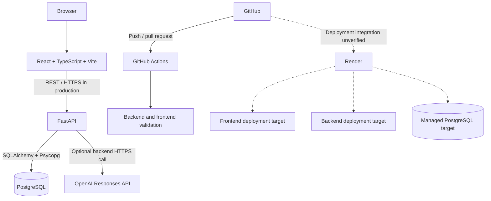
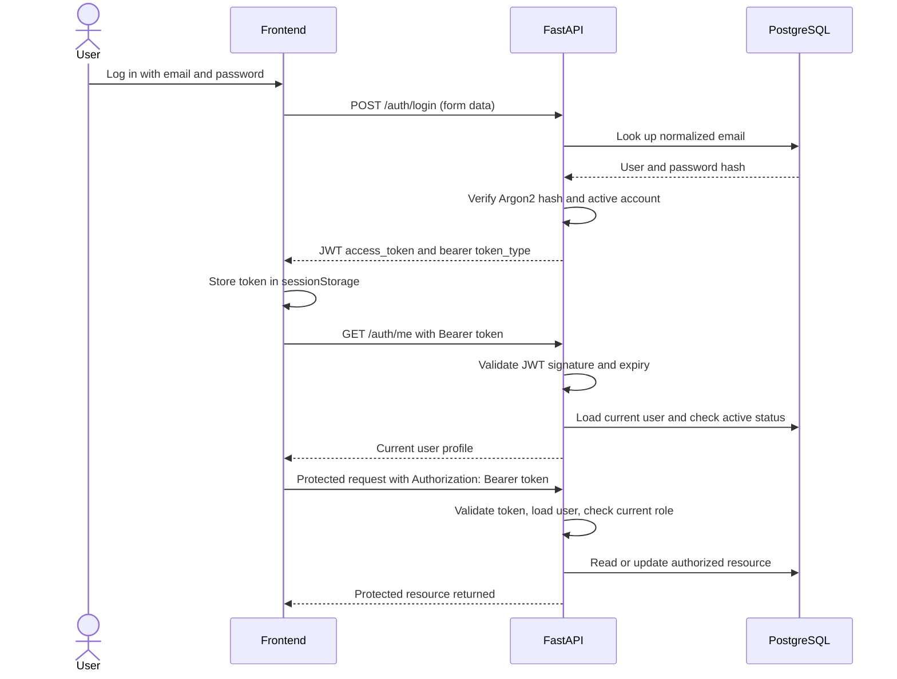
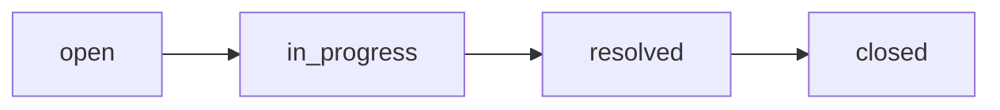
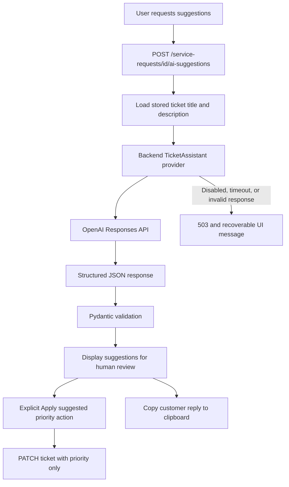
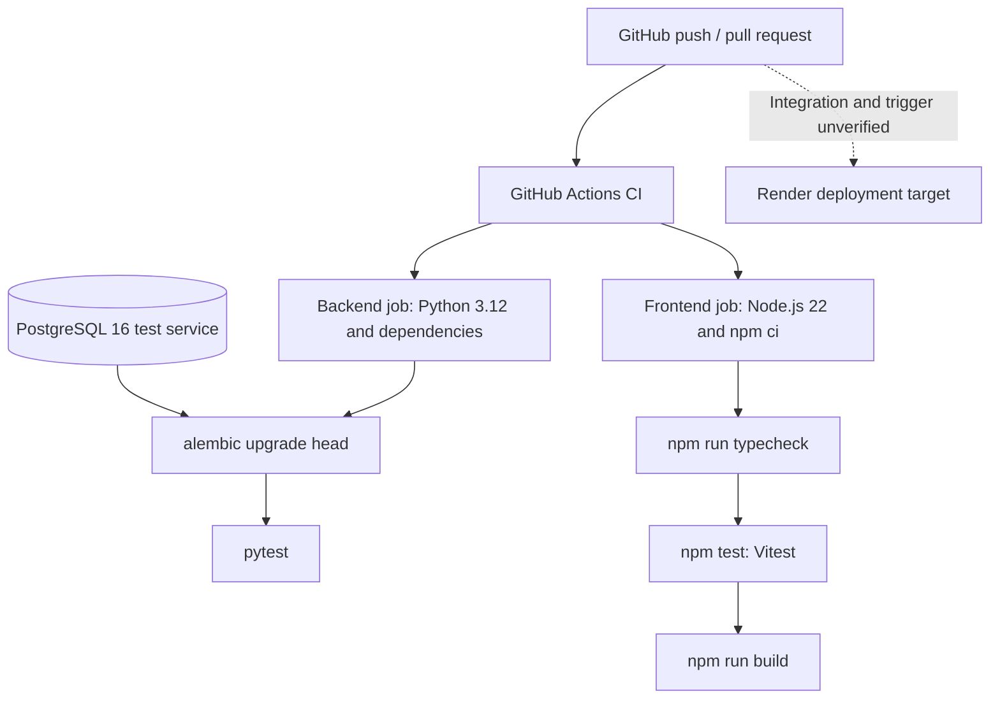

# ServiceFlow AI Architecture

## 1. System overview

ServiceFlow AI is a customer service application for managing customers, service requests, agent assignments, and operational dashboards. Administrators manage team access and assignments; agents work with customer records and tickets. An optional AI Ticket Assistant supports triage and drafts customer replies for human review.

The implementation consists of a React single-page application, a FastAPI backend organized into feature modules, and a PostgreSQL database. The browser communicates with the REST API; database access and AI provider calls run in the backend.

This document describes the checked-in implementation. GitHub Actions validation and Docker Compose deployment are verified in the repository. Render is the requested production deployment target, but no Render manifest, deployment workflow, or confirmed production URLs are recorded; Render-specific connections below are therefore unverified.

## 2. High-level architecture

Solid connections represent implemented application or CI flows. Dashed connections describe the requested Render hosting topology, including database provisioning rather than a database build on every push. HTTPS is the production transport expectation; the checked-in local Compose setup uses HTTP.

In Compose, Nginx serves the frontend build and proxies `/api/` to `backend:8000`, removing the `/api` prefix. The API itself exposes paths such as `/auth/login` and `/service-requests`. During frontend development, `VITE_API_URL` can point directly to the backend.

## 3. Authentication flow

Login uses OAuth2 password form encoding: the `username` field contains the email address. JWTs contain `sub`, `role`, `iat`, and `exp`. Authorization uses the user's current database role, so a role change takes effect on subsequent requests even if the JWT contains an older role.

Invalid credentials, expired or invalid tokens, and inactive accounts receive `401`; insufficient permissions receive `403`. The frontend clears authentication on `401`. Logout clears the browser token and user state. No refresh-token or server-side logout endpoint is implemented.

## 4. Role-based access matrix

Permissions below describe the backend API for active accounts. Frontend navigation and controls reflect these permissions.

| Resource or operation | Admin | Agent |
| --- | --- | --- |
| Own profile: `GET /auth/me` | Allowed | Allowed |
| Users: create, list, read, change role or active status | Allowed | Denied |
| Customers: create, list, read, edit | Allowed | Allowed |
| Service requests: create, list, read, edit title, description, status, priority | Allowed | Allowed |
| Assignment: assign, reassign, unassign | Allowed; target must be an active agent or `null` | Denied |
| Delete customers | Allowed, subject to relationship constraints | Denied |
| Delete service requests | Allowed | Denied |
| Delete users | No endpoint; activation/deactivation is supported | No endpoint |
| Dashboard: `/dashboard/overview` | Allowed; organization-wide totals and breakdowns | Denied |
| Dashboard: `/dashboard/my-work` | Denied; endpoint requires Agent role | Allowed; own assigned work |
| AI suggestions | Allowed | Allowed |
| Explicitly apply suggested priority | Allowed through ordinary ticket update | Allowed through ordinary ticket update |
| Copy suggested customer reply | Available in the UI | Available in the UI |

Agents can access all customers and service requests; ticket access is not restricted to the creator or assigned agent. Only the agent dashboard is scoped to the current agent. Administrators cannot demote or deactivate their own account. Assignment is a separate endpoint, and general ticket create/update schemas reject assignment fields.

## 5. Service-request lifecycle

This diagram illustrates the normal progression represented by the status vocabulary:

- `open`: newly recorded work; the default status.
- `in_progress`: work being handled.
- `resolved`: work marked as resolved.
- `closed`: work marked as closed.

The API validates membership in these four values but does not enforce the sequence above. Creation accepts any valid status, and updates can move directly between valid statuses, including reopening a ticket. There are no transition-specific side effects. Priority is independently editable as `low`, `medium` (the default), or `high`.

## 6. AI Ticket Assistant flow

The route loads the ticket from PostgreSQL and passes only its stored title and description to `TicketAssistant.suggest`. The OpenAI implementation uses HTTPX to call `https://api.openai.com/v1/responses`, requesting a strict JSON schema. The backend validates the resulting JSON again using Pydantic.

| Response field | Purpose |
| --- | --- |
| `summary` | Concise ticket summary |
| `suggested_priority` | One of `low`, `medium`, or `high` |
| `recommended_action` | Suggested next step for the operator |
| `suggested_customer_reply` | Customer reply draft; the prompt requests professional French |

The customer-reply concept is sometimes described as `customer_reply`; the actual API and frontend field is **`suggested_customer_reply`**. All text fields must be nonempty, and extra fields are rejected.

Suggestions are returned without persistence or automatic ticket mutation. The user reviews them and may explicitly apply the suggested priority through the normal authorized `PATCH /service-requests/{id}` endpoint. The frontend then refreshes ticket and dashboard queries. Copying the customer reply uses `navigator.clipboard.writeText`; it does not send a message or change the ticket.

The provider prompt treats ticket content as data and asks the model to avoid claims about completed actions or unsupported resolution times. Disabled configuration, provider HTTP errors, malformed responses, and timeouts produce a safe failure response. The interface displays an AI availability/error message while ordinary ticket operations remain available.

## 7. Database architecture

PostgreSQL stores three main entities, mapped through SQLAlchemy:

| Entity / table | Main attributes | Relationships |
| --- | --- | --- |
| User / `users` | ID, email, password hash, role, active status, creation/update timestamps | Creates many requests; may be assigned many requests |
| Customer / `customers` | ID, name, email | Has many service requests |
| ServiceRequest / `service_requests` | ID, title, description, status, priority, creation/update timestamps | Belongs to one customer and one creator; optionally assigned to one user |

The users migration creates a unique index on `lower(email)`. Status, priority, and user role use string-backed SQLAlchemy enums with database check constraints. Ticket indexes support filtering by customer, assignee, status, and priority.

| Service-request foreign key | Nullability | Verified database behavior |
| --- | --- | --- |
| `customer_id` -> `customers.id` | Required | `ON DELETE RESTRICT` protects referenced customers |
| `created_by_user_id` -> `users.id` | Required | `ON DELETE RESTRICT` preserves the creator reference |
| `assigned_agent_id` -> `users.id` | Optional | `ON DELETE SET NULL` removes the assignment if the referenced user is deleted, subject to other constraints |

These rules appear in both the model and the service-request migration. The backend derives `created_by_user_id` from the authenticated user. The assignment route verifies that the assignee exists, is active, and has the Agent role; that role condition is an application rule rather than a foreign-key constraint.

There is no user-deletion endpoint, and deactivation does not automatically clear assignments. A user referenced as a creator remains protected by `RESTRICT` even if other assignments would allow `SET NULL`. Customer deletion does not cascade to tickets; the current router/repository does not translate relationship integrity failures into a dedicated conflict response.

## 8. Backend architecture

The backend is a single FastAPI application with feature-oriented modules:

- **Routers:** `app/main.py` registers authentication, users, customers, service requests, and dashboard routers. Handlers coordinate validation, authorization, repository calls, and HTTP responses.
- **Schemas:** Pydantic models define request and response contracts. Ticket schemas reject unexpected fields and constrain status, priority, and text values. User API schemas live in the authentication module.
- **SQLAlchemy models:** `UserModel`, `CustomerModel`, and `ServiceRequestModel` map relational tables and relationships.
- **Repositories:** feature repositories encapsulate SQL queries and persistence. User management reuses `auth/repository.py`; dashboard aggregation has its own repository. Mutating repositories commit and refresh records as needed.
- **Database dependency:** `get_db` supplies a session for a request and closes it afterward. The engine enables `pool_pre_ping` to check pooled connections before use.
- **Authentication dependencies:** bearer-token extraction, current-user lookup, and `require_roles` compose into `AuthenticatedUser`, `AdminUser`, and `AgentUser` dependencies.
- **AI abstraction:** a `TicketAssistant` protocol defines `suggest`; dependency injection selects `OpenAITicketAssistant` or `DisabledTicketAssistant`. Provider failures use the shared `TicketAssistantError` type.
- **Migrations:** Alembic maintains ordered customer, user, and service-request migrations. Its environment loads the shared model metadata and database URL. CI and Compose explicitly run `alembic upgrade head`; application startup itself does not run migrations.

Implementation references: [application entry point](../backend/app/main.py), [authentication dependencies](../backend/app/auth/dependencies.py), [ticket router](../backend/app/service_requests/router.py), [AI provider](../backend/app/ai/provider.py), and [migrations](../backend/alembic/versions/).

## 9. Frontend architecture

- **Pages and routing:** React Router defines login, dashboard, customers, service requests, users, and not-found pages. Shared layout and UI components provide navigation, tables, modals, fields, and feedback states.
- **Authentication:** `AuthProvider` manages the current user, login, logout, and session restoration through `/auth/me`. `ProtectedRoute` guards authenticated pages; `RoleRoute` restricts the users page to administrators.
- **API client:** a shared Fetch wrapper uses `VITE_API_URL`, adds the bearer token, parses JSON and validation errors, handles empty `204` responses, and clears authentication on `401`. Endpoint functions and TypeScript types describe resource contracts.
- **TanStack Query:** queries cache server data and track loading/error states; mutations perform writes and invalidate relevant queries. Ticket changes invalidate ticket and dashboard data. AI suggestions are held in local component state for review.
- **Forms and Zod:** React Hook Form manages form state, with Zod schemas and resolvers providing client-side validation. Backend schemas independently validate API requests.
- **Role-aware UI:** navigation, user management, assignment, and deletion controls depend on the current role. The request page fetches the user list only for administrators. Backend dependencies remain the authority for permissions.
- **Tests and MSW:** Vitest runs with jsdom and React Testing Library. MSW intercepts HTTP requests, supplies API fixtures, and treats unhandled requests as errors. Tests cover authentication routing, role-aware controls, assignment/status edits, AI review, explicit priority updates, clipboard behavior, and failure states.

Implementation references: [router](../frontend/src/app/router.tsx), [providers](../frontend/src/app/providers.tsx), [API client](../frontend/src/api/client.ts), [ticket page](../frontend/src/pages/ServiceRequestsPage.tsx), and [frontend tests](../frontend/src/test/app.test.tsx).

## 10. CI/CD flow

The [CI workflow](../.github/workflows/ci.yml) runs independent backend and frontend jobs on pushes and pull requests. The backend job provisions a health-checked `postgres:16-alpine` service, configures an isolated test database, installs dependencies, applies migrations, and runs pytest. Tests include authentication, permissions, resource operations, dashboards, migration round trips, and AI success/failure behavior.

The frontend job installs locked dependencies with `npm ci`, runs TypeScript checking, executes Vitest, and builds the production bundle. Repository permissions are limited to `contents: read` for this workflow.

The workflow contains validation only. There is no Render deployment step or evidence that Render waits for these checks. Deployment triggers, branch selection, and CI gating must be confirmed in the hosting configuration before describing delivery as automatic.

## 11. Security decisions

- **JWT:** signed, expiring bearer tokens use a configurable algorithm (default `HS256`) and lifetime (default 30 minutes). Configuration requires a secret of at least 32 characters. Each authenticated request checks that the account still exists and is active, and protected routes use its current database role.
- **Argon2:** passwords are hashed through `pwdlib` with Argon2 support. Unknown-user login attempts follow a dummy-hash verification path, and invalid login responses use a generic message.
- **Environment variables:** database credentials, JWT configuration, bootstrap credentials, and AI settings are read from the environment. Example files document configuration; production values must be supplied through deployment settings.
- **Backend-only OpenAI key:** `AI_API_KEY` is consumed by the backend provider. The browser requests suggestions from FastAPI and never needs the provider key. Frontend `VITE_*` configuration is included in the public build and is suitable for the API URL, not secrets.
- **CORS:** FastAPI reads an explicit comma-separated origin list from `CORS_ORIGINS`; the default is `http://localhost:5173`. Credentials, methods, and headers are allowed for configured origins. CORS configuration complements API authentication.
- **Browser token storage:** the JWT is stored in `sessionStorage`, making it accessible to page JavaScript. This choice supports session restoration within the tab and makes prevention of script injection important.
- **Human control over AI:** generation has no database write step. Applying priority requires an explicit authenticated update; copying a reply only changes the clipboard.
- **Graceful AI failure:** provider-independent errors become a generic `503` response without exposing provider details. AI is disabled by default and is optional for the core workflow.

## 12. Production deployment overview

The requested production topology is a Render frontend, Render backend, and Render PostgreSQL database. The repository provides compatible application build/runtime components, but does not establish that these services are deployed or connected.

| Target | Repository-backed deployment considerations |
| --- | --- |
| Render frontend | Vite builds `frontend/dist`. Set the public backend base URL through build-time `VITE_API_URL`. Browser routing requires an `index.html` fallback; the checked-in Nginx configuration implements this for the container setup. The actual Render serving mode is unverified. |
| Render backend | Serve `app.main:app` with Uvicorn. The Dockerfile starts two workers on port 8000. Apply Alembic migrations separately or through an explicit deployment command; the Dockerfile alone does not run them. Actual Render port/start settings are unverified. |
| Render PostgreSQL | Supply a SQLAlchemy-compatible `DATABASE_URL` using the installed Psycopg driver, as illustrated by `postgresql+psycopg://...` in CI. Apply the three migrations to create the schema. Managed database provisioning and connection settings are unverified. |

Backend environment settings include `DATABASE_URL` (or the supported PostgreSQL host/port/credential variables), `JWT_SECRET_KEY`, `JWT_ALGORITHM`, `JWT_ACCESS_TOKEN_EXPIRE_MINUTES`, and `CORS_ORIGINS`. Optional AI settings are `AI_PROVIDER=openai`, `AI_API_KEY`, `AI_MODEL`, and `AI_TIMEOUT_SECONDS`. Initial administrator setup uses `BOOTSTRAP_ADMIN_EMAIL`, `BOOTSTRAP_ADMIN_PASSWORD`, and the explicit `python -m app.auth.bootstrap` command.

The unauthenticated backend `GET /health` endpoint returns `{"status":"ok"}`. It checks application liveness only; it does not test PostgreSQL connectivity or AI availability. The frontend Nginx container has its own `/health` response. Confirmed public URLs, live environment values, TLS configuration, deployment status, and the GitHub-to-Render connection cannot be verified from this repository.

## 13. Interview talking points

- Why a single FastAPI application with feature modules fits this project's scope, and how routers, schemas, models, and repositories divide responsibilities.
- Why authorization reloads the database user despite including a role claim in the JWT; explain deactivation, role changes, and the browser storage tradeoff.
- How Admin and Agent permissions differ, including organization-wide ticket access and the agent-only personal dashboard.
- Why creator and customer references use `RESTRICT`, while optional assignment uses `SET NULL`; distinguish foreign-key guarantees from active-agent validation.
- Why status values are constrained while transitions remain flexible, and what would be needed for a strict lifecycle.
- How TanStack Query handles server state and invalidation, while form and AI review state remain local to the UI.
- Why AI runs behind a provider interface, uses structured output plus backend validation, and requires explicit human action before changing priority.
- How real PostgreSQL backend tests and MSW-based frontend tests exercise different boundaries, and why migrations run in CI.
- How validation differs from deployment: explain the verified Compose setup and the Render configuration that still requires confirmation.
